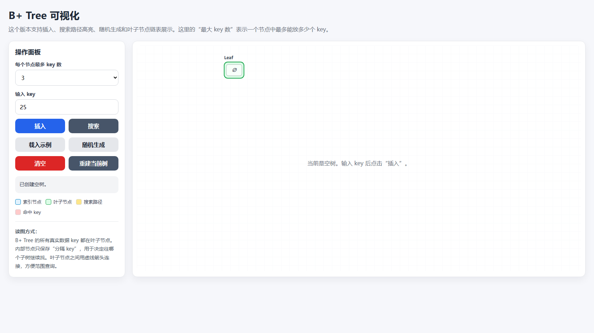
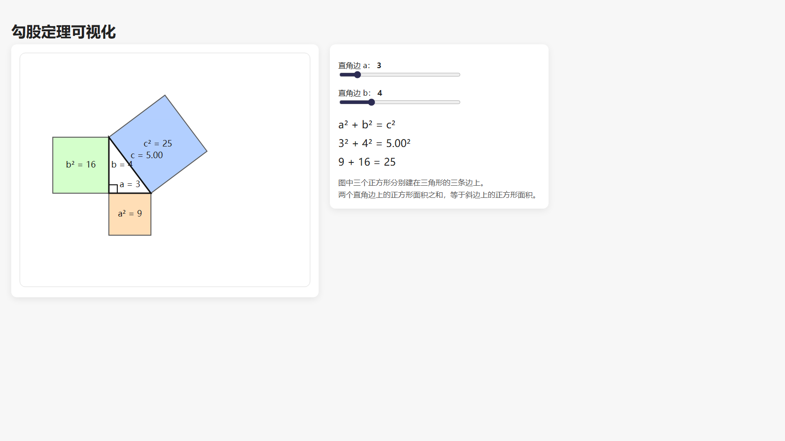

# HTML to PPT Interactive Packager

一个把本地 HTML 可视化页面放进 PowerPoint 的小工具。

## 效果示例

### B+ Tree 可视化



### 勾股定理可视化



适合这种场景：

- 用 GPT 生成了一个单文件 HTML 可视化页面；
- 希望它在 PowerPoint 里直接交互，而不是跳转浏览器；
- 想把多个已经生成的 HTML-PPT 页面合并成一个多页 PPT。

## 环境要求

- Windows
- Microsoft PowerPoint 桌面版
- Python 3

> WPS 不能运行这种 PowerPoint Web Add-in 交互页。

## 使用方法

### 1. 单个 HTML 生成 PPT 文件夹

把 `.html` 文件拖到：

```text
MAKE_PPT_FOLDER.bat
```

生成结果在：

```text
outputs/
```

进入生成的文件夹后，双击：

```text
START_HERE.bat
```

它会自动注册加载项、启动本地服务、打开 PPT。

### 2. 合并多个已生成 PPT 文件夹

先用 `MAKE_PPT_FOLDER.bat` 生成多个小文件夹。

然后在 `outputs` 里全选这些文件夹，一起拖到：

```text
MERGE_GENERATED_PPTS.bat
```

生成结果在：

```text
collections/
```

进入生成的文件夹后，双击：

```text
START_HERE.bat
```

## 演示文件

本机演示 HTML 在：

```text
C:\Users\39517\Desktop\Babybook\temp\try_htmls
```

可以把里面的这些 HTML 拖到 `MAKE_PPT_FOLDER.bat` 测试：

```text
B+tree.html
ggdl.html
soi_interactive_visual.html
```

## 给 GPT 生成 HTML 的建议

可以这样要求：

```text
{{你想要可视化的内容}}
请生成一个单文件 HTML，可直接在浏览器打开。
CSS 和 JS 都写在同一个 HTML 里。
不要使用 CDN、npm、外网资源或后端接口。
页面适合 16:9 PPT 展示。
```
